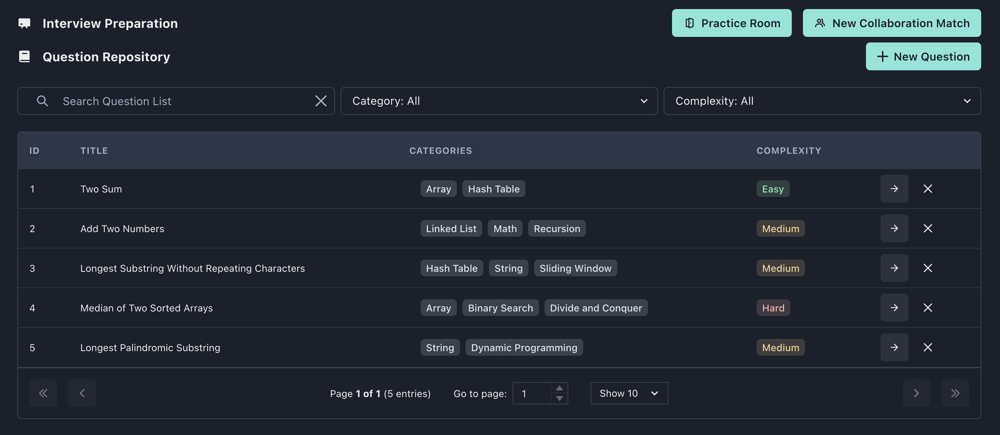

[](https://classroom.github.com/a/UxpU_KWG)

# ServerlessTemplate

This repository contains our serverless function to scrape leetcode for questions.

## Set Up

### viewing the results (deployed frontend)

The easiest way to view the results is to go to our [deployed frontend](https://master.da377qx9p9syb.amplifyapp.com/) and login with...

Username: regular_user<br>
Password: user_password



### running the function

### using the serverless cloud function

Our serverless function can be found here:
https://us-central1-peerprep-400701.cloudfunctions.net/scrape-leetcode (but this will scrape all questions, don't click unless you want to wait 8++ minutes!)

To test quickly:

1. visit https://us-central1-peerprep-400701.cloudfunctions.net/scrape-leetcode?limit=30
   - You can change the limit number if it is already 30 to make changes more noticable.
   - Use a smaller number to view quicker results.
2. refresh frontend on browser

### running it locally

```bash
pip3 install -r requirements.txt
python3 main.py <limit>
```

for example, `python3 main.py 10` would reset the database with the first 10 questions from leetcode, excluding leetcode premium questions.
